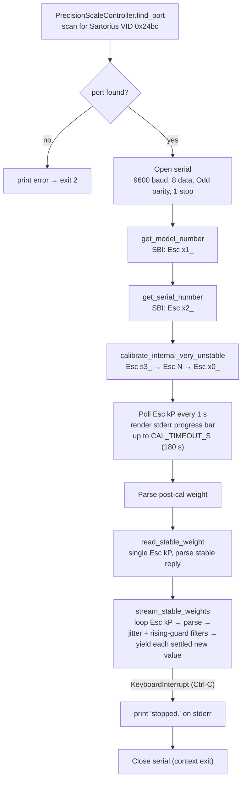

# PrecisionScaleController

**Sartorius Entris-II precision balance controller — with project-wide Claude Code conventions**

This repository hosts the PrecisionScaleController project together with the rules and workflows every [Claude Code](https://claude.ai/code) session in it must follow. The canonical ruleset lives in [`CLAUDE.md`](CLAUDE.md) (no separate `CommonClaude.md` file).

---

## What This Project Does

`PrecisionScaleController` drives a **Sartorius Entris-II precision balance** (verified on the BCE224I-1SKR variant with the internal-weight option) over its USB-C virtual COM port using the **SBI** ASCII protocol. The Python package exposes one facade class — [`PrecisionScaleController`](src/entris_ii/precision_scale_controller.py) — that handles:

- Auto-detection of the balance by Sartorius USB vendor ID `0x24bc`.
- Read-only identity queries (model number, serial number).
- Internal calibration with the "very unstable" ambient hint, plus a live elapsed/total progress bar on stderr.
- One-shot stable-weight reads.
- A long-running stable-weight stream that applies jitter and rising-guard filters before yielding each new value.

For an end-to-end demo, run [`main.py`](main.py). For flag-driven access there is also a CLI: `entris_ii.cli.diagnose` (read-only) and `entris_ii.cli.measure` (cal / read / watch).

---

## Quick Start

```bash
# 1. Plug the balance into a USB-C port. Make sure the front-panel
#    menu is configured for SBI use:
#      - STAB.RNG = V.FAST   (BCE manual §7.3.1) — calibration only
#      - COM.OUTP = IND.AFTR (BCE manual §7.3.6) — "Manual with
#                              stability"; equivalent to Code 3.1.1.x
#    Both parameters are menu-only — see "Menu-only calibration
#    preconditions" below for the reason. The pan must be empty for
#    the calibration step.

# 2. Confirm the device is enumerated.
ls /dev/ttyACM*           # expect e.g. /dev/ttyACM0

# 3. Run the end-to-end demo. Auto-detects the port by VID.
python3 main.py

# 4. Or use the CLI for finer control.
PYTHONPATH=src python3 -m entris_ii.cli.measure cal           # internal calibration
PYTHONPATH=src python3 -m entris_ii.cli.measure read          # one stable read
PYTHONPATH=src python3 -m entris_ii.cli.measure watch         # continuous stream
PYTHONPATH=src python3 -m entris_ii.cli.diagnose --help       # read-only ID queries
```

If `find_port` cannot locate the balance you can pass `--port /dev/ttyACM0` (or whatever path your OS chose).

---

## Computational Flow of `main.py`



The two stream-level filters are exposed as class constants on `PrecisionScaleController`:

| Constant | Default | Meaning |
|---|---|---|
| `JITTER_THRESHOLD` | `0.01` | Skip readings whose absolute change vs. the last *yielded* value is below this band. |
| `RISING_WINDOW` | `5` | Rolling history size for the rising guard. `0` disables it. |
| `RISING_THRESHOLD` | `0.05` | While `current − min(window) ≥ this`, hold the reading back as still climbing. |

Pass per-call overrides (`stream_stable_weights(jitter_threshold=..., rising_window=..., rising_threshold=...)`) when you need different behavior — for example, `jitter_threshold=0` falls back to exact-float deduplication only.

---

## SBI Protocol Primer

This section is for engineers who have not worked with a Sartorius SBI link before. Authoritative reference: [`entris-ii-technical-note-en-sartorius.pdf`](entris-ii-technical-note-en-sartorius.pdf) §"Commands (Data Input Format)".

### Physical and serial layer

| Setting | Value | Notes |
|---|---|---|
| Transport | USB-C virtual COM (CDC ACM) | Sartorius vendor ID `0x24bc`. |
| Baud rate | 9600 | Factory default; menu can change it. |
| Data bits | 8 | |
| Parity | **Odd** | Non-standard for many tools — must be set explicitly. |
| Stop bits | 1 | |
| Flow control | none | No RTS/CTS, no XON/XOFF. |

The package opens the port with exactly these settings (`DEFAULT_*` constants on `PrecisionScaleController`).

### Command framing

Every SBI control command leaves the host as:

```
<ESC 0x1B> <payload bytes> <CR 0x0D> <LF 0x0A>
```

The payload defines which **format** the command uses:

| Format | Payload shape | Examples |
|---|---|---|
| Format 1 | A single character or short mnemonic, **no terminator** | `Esc Z` (open cal menu), `Esc N` (ambient = very unstable), `Esc kP` (request print) |
| Format 2 | Multi-character payload **terminated with `_`** | `Esc x0_` (run internal cal), `Esc x1_` (model number), `Esc x2_` (serial number) |

Format-1 and Format-2 commands can have similar-looking effects but are not interchangeable. The most important example is calibration: Format-1 `Esc Z` only *opens* the internal-cal menu on this balance and waits for human confirmation, while Format-2 `Esc x0_` actually *executes* the procedure. This is documented in [`LearnedPatterns.md`](LearnedPatterns.md) §Q3 and is why `CMD_INTERNAL_CAL` is wired to `Esc x0_`.

### Response framing

Responses arrive as ASCII lines terminated by `CR LF`. The package strips the framing and returns a `str`.

There are two shapes worth knowing about:

| Shape | Width | Example | Notes |
|---|---|---|---|
| 16-char standard | 16 | `+    0.0000 g` | Sign, value, unit. |
| 22-char ID-coded | 22 | `N       0.0000 g` | Leading ID label (`N` net, `G` gross, `T1` tare, `Diff`, etc.), value, unit. |
| 22-char ID-coded, unit missing | 16–22 | `G         0.0000` | Same shape but no trailing unit. Observed on the BCE224I both as a brief drift line during cal and intermittently during normal stable reads — see [`LearnedPatterns.md`](LearnedPatterns.md) §Q4. The parser accepts this form and returns `unit=""`. |

### Status and error markers

Some response lines are not weight values. The parser raises `ValueError` so the caller can skip them, or `RuntimeError` for hard errors:

| Marker | Meaning | Parser behavior |
|---|---|---|
| `Stat …` | Unstable reading; menu is misconfigured for Approach A | `ValueError` |
| `Cal.Run.` / `Cal.End` / `Cal.Ext.` / `Cal.Int.` | Calibration in progress or complete | `ValueError` (cal polling loop swallows and continues) |
| `H` / `High` | Overload | `ValueError` |
| `L` / `Low` | Underload | `ValueError` |
| `Err <NNN>` / `APP.ERR` / `DIS.ERR` / `PRT.ERR` | Error code per Technical Note | `RuntimeError` |

`stream_stable_weights` additionally catches `ValueError` from the parser and logs the skip at debug level, so a one-off non-numeric line never tears down the loop.

### "Manual with stability" menu (Approach A)

`read_stable_weight` and `stream_stable_weights` rely on the balance's printer menu (Code 3.1.1.x) being set to **"Manual with stability"** rather than the factory default `IND.NO`. In this mode the balance buffers each `Esc kP` request internally until the reading stabilizes and only then emits the value. The controller is therefore stateless w.r.t. stability — every read is a blocking call that returns one settled value.

If the menu is not set this way, you will see `Stat`-prefixed responses and `read_stable_weight` will raise `ValueError`. Either change the menu or use the cal polling loop's pattern (catch the error and retry).

### Menu-only calibration preconditions

Two further front-panel menu items affect calibration behaviour but are **not reachable via SBI** on the Entris-II BCE224I — the SBI command tables in the [Technical Note](entris-ii-technical-note-en-sartorius.pdf) p.4 list no command for either. They must be configured on the balance before invoking `calibrate_internal_very_unstable`.

| Menu item | Manual ref | Recommended value | Why |
|---|---|---|---|
| `SETUP → BALANCE → STAB.RNG` | [BCE manual §7.3.1, p.18](manual-entris-bce-precisionbalances-wbc6001bo-pdf-62843--data.pdf) | `V.FAST` | Fastest stability filter, paired with the very-unstable ambient hint that the controller forces via `Esc N`. Distinct from AMBIENT (which **is** SBI-settable via `Esc K/L/M/N`) — same family of "how strictly should the balance treat the reading as settled?", different menu item. |
| `SETUP → DATA.OUT. → COM. SBI → COM.OUTP` | [BCE manual §7.3.6, p.22](manual-entris-bce-precisionbalances-wbc6001bo-pdf-62843--data.pdf) | `IND.AFTR` | Manual output **after** stability — the Approach A value. Available values are `IND.NO` (factory default, no stability gating), `IND.AFTR`, `AUTO.W/O` (automatic, no stability), `AUTO W/` (automatic on stability). |

`AUTO W/` is intentionally **not** recommended even though it sounds like the closest match to what calibration wants: it would push auto data on stability and conflict with the controller's `Esc kP` polling. If you need a true auto-print workflow, the controller would have to switch from polling to a passive read loop — out of scope for the current Approach A.

Operators changing these menus should do so once at setup time; the balance persists them across power cycles.

### Putting it together

A typical session looks like this on the wire:

```
host → balance       Esc x1_ CR LF
balance → host       BCE224I-1SKR CR LF
host → balance       Esc x2_ CR LF
balance → host       <serial> CR LF
host → balance       Esc s3_ CR LF                # cancel any leftover menu
host → balance       Esc N   CR LF                # ambient: very unstable
host → balance       Esc x0_ CR LF                # run internal cal
host → balance       Esc kP  CR LF                # poll …
balance → host       Stat Cal.Run. CR LF          # in progress
host → balance       Esc kP  CR LF                # poll …
balance → host       Stat Cal.End  CR LF          # done
host → balance       Esc kP  CR LF                # poll …
balance → host       G         0.0000 g CR LF     # post-cal zero
host → balance       Esc kP  CR LF                # stable read
balance → host       +    0.0000 g CR LF          # buffered stable value
```

---

## Package Layout

| Path | Purpose |
|---|---|
| [`main.py`](main.py) | End-to-end demo (auto-detect port → ID queries → cal → stable read → filtered stream). |
| [`src/entris_ii/precision_scale_controller.py`](src/entris_ii/precision_scale_controller.py) | The `PrecisionScaleController` class and the `WeightReading` NamedTuple. |
| [`src/entris_ii/cli/diagnose.py`](src/entris_ii/cli/diagnose.py) | Read-only CLI: ID queries, never moves the balance. |
| [`src/entris_ii/cli/measure.py`](src/entris_ii/cli/measure.py) | CLI: `cal`, `read`, `watch` subcommands. |
| [`claude_test/`](claude_test/) | Debug and bench scripts (e.g. `test_cal_and_read.py`). |
| `*.pdf` (root) | Sartorius datasheet, Technical Note, and BCE manual. |

---

## Environment

| Item       | Detail                                 |
|------------|----------------------------------------|
| Runtime    | Docker container (`--privileged`)      |
| OS         | Ubuntu 24.04 (Noble)                   |
| Dev tool   | Claude Code (CLI / VS Code extension)  |

---

## Convention Summary

### 1. MIT Code Convention

Follows the [MIT CommLab Coding and Comment Style](https://mitcommlab.mit.edu/broad/commkit/coding-and-comment-style/).

| Element  | Style        | Example            |
|----------|--------------|--------------------|
| Variable | `lower_case` | `joint_angle`      |
| Function | `lower_case` | `send_action`      |
| Class    | `CamelCase`  | `FairinoFollower`  |
| Constant | `lower_case` | `_settle_mid_s`    |
| Module   | `lowercase`  | `fairino_follower`  |

- 80-column limit, 4-space indentation
- Google-style docstrings required (`Args:`, `Returns:`, `Raises:`)
- All comments, docstrings, and documentation must be in **English**
- TODO format: `# TODO: (@owner) description`

### 2. Debug File Management

| Location        | Purpose                                     |
|-----------------|---------------------------------------------|
| `tests/`        | Production-quality tests for CI/CD          |
| `claude_test/`  | Debug scripts, one-off experiments          |

### 3. Task Management

Every task follows this workflow:

1. **Validate input** — Check if the command is explicit and if reference materials exist
2. **Write ToDo.md** — Organize the task list
3. **User confirmation** — Get approval on ToDo.md contents
4. **Create GitHub issue** — Register via `gh issue create`
5. **Execute** — Check off completed items in ToDo.md
6. **Update issue** — Sync progress via `gh issue edit`

### 4. Testing Rules

- **No magic numbers** — Use meaningful constants instead of unexplained values
- **No hardcoding** — Never write code that only passes specific test inputs
- **Code quality first** — Prioritize readability, maintainability, and correctness over passing tests

### 5. Using `ultrathink`

When in **plan mode** or tackling **complex tasks**, append `ultrathink` to the end of your command. This signals Claude to use extended reasoning for deeper analysis.

```
# Example
Review this entire codebase ultrathink
```

---

## Automated Enforcement (Hooks)

This repository uses [Claude Code hooks](https://code.claude.com/docs/en/hooks) to automatically enforce the conventions above. Hooks run on every tool call matching their event and either block the action or feed errors back to Claude for self-correction.

| Hook Script | Event | Rule Enforced | Behavior |
|---|---|---|---|
| [`pre-write-guard.sh`](.claude/hooks/pre-write-guard.sh) | PreToolUse (Write/Edit) | §2 Debug File Management | **Blocks** writing `debug_*`, `scratch_*`, `tmp_*`, `experiment_*` files into `tests/` |
| [`post-write-lint.sh`](.claude/hooks/post-write-lint.sh) | PostToolUse (Write/Edit) | §5 Linting | Runs `ruff check` + `ruff format --check` on every Python file write; **feeds errors back** to Claude |
| [`post-write-debug-remind.sh`](.claude/hooks/post-write-debug-remind.sh) | PostToolUse (Write/Edit) | §2 Debug File Management | Reminds to update `claude_test/README.md` when adding files to `claude_test/` |
| Stop prompt hook | Stop | §3 Task Management | Verifies that `ToDo.md` has an entry and a GitHub issue exists before Claude finishes |

Configuration lives in [`.claude/settings.json`](.claude/settings.json), and the linter is configured by [`ruff.toml`](ruff.toml) (80-column, 4-space, rules `E/F/W/I/N`).

**Not enforced via hooks** (kept in `CLAUDE.md` as instructions): comment quality, English-only rule, magic-number/hardcoding rules, and command input validation — these require human judgment.

---

## Claude Code IDE Commands

| Command            | Description                                         |
|--------------------|-----------------------------------------------------|
| `/clear`           | Clears Claude's memory context.                     |
| `/rewind`            | Re-executes the previous action.                  |
| `/memory`          | Adds specific content to memory.                    |
| `/permission`      | Configures permissions for Bash, Edit, Write, etc.  |
| `/review`          | Checks the current session's context cost.          |
| `/output-style`    | Switches the output style (Default, Explanatory, Learning) or applies a custom style. |

---

## Claude Code Shortcuts (VS Code)

| Shortcut                     | Description                                      |
|------------------------------|--------------------------------------------------|
| `Shift` + `Tab`              | Toggles approval mode.                           |
| `Ctrl` + `Shift` + `E`       | Opens the Explorer panel.                        |
| `Ctrl` + `Shift` + `X`       | Opens the Extensions panel.                      |
| `Alt` + `K`                  | Starts an inline editor reference.               |


---

## Hardware Reference

Sartorius Entris-II datasheets and manuals are checked in at the repository root and serve as §7 ("Research Before Coding") sources:

- `Entris-II-Essential-Datasheet-en-L-Sartorius.pdf`
- `entris-ii-technical-note-en-sartorius.pdf`
- `manual-entris-bce-precisionbalances-wbc6001bo-pdf-62843--data.pdf`

---

## References

- Full rules: [`CLAUDE.md`](CLAUDE.md)
- Learned patterns: [`LearnedPatterns.md`](LearnedPatterns.md)
- Cumulative task log: [`ToDo.md`](ToDo.md)
- [ClaudeCode for vscode](https://code.claude.com/docs/en/vs-code#extension-settings)
- [클로드 코드를 활용한 바이브 코딩 완벽입문](https://product.kyobobook.co.kr/detail/S000219349783)
- [한 걸음 앞선 개발자가 지금 꼭 알아야할 클로드 코드](https://product.kyobobook.co.kr/detail/S000217402731)
